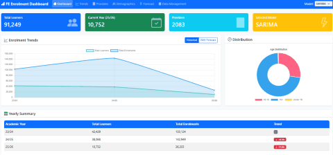

# Week 03
# Snowflake Data Warehouse & Enrolment Forecasting

## Overview
End-to-end pipeline using Snowflake, Python, forecasting models, and a dashboard to analyse and predict FE college enrolments.

## Tasks Performed

### 1. Understanding Snowflake Data Warehouse
- Reviewed Snowflake architecture
- Analysed fact and dimension tables
- Identified time-series structure

### 2. Connecting Snowflake to Python
- Connected via snowflake-connector-python
- Extracted data using SQL
- Loaded data into pandas

### 3. Dashboard Development
- Visualised enrolment trends
- Added filters and KPIs
- Export-ready outputs

### 4. Forecasting Models
- ARIMA for trend forecasting
- SARIMA for seasonal patterns

### 5. UI/UX Design
- Clean layout and consistent styling
- Improved usability and readability

🎨 UI/UX Preview  


---

# FE College Enrolment Forecasting Project

## Project Overview
Predictive analytics solution for forecasting learner enrolment trends in FE colleges.

## Database Structure (Snowflake)

| Schema | Table | Purpose |
|------|------|---------|
| PRESENTATION | FACT_ENROLMENT | Enrolment metrics |
| PRESENTATION | FACT_FUNDING | Funding data |
| PRESENTATION | DIM_LEARNER | Learner demographics |
| PRESENTATION | DIM_SSA | Subject areas |
| PRESENTATION | DIM_AGE | Age groups |
| PRESENTATION | DIM_ACADEMIC_YEAR | Time dimension |
| PRESENTATION | DIM_PROVIDER | Provider info |
| PRESENTATION | DIM_LEVEL | Qualification levels |

## Project Modules
- `snowflake_meta.py` – Snowflake connection
- `data_extractor.py` – Data extraction
- `data_preprocessor.py` – Data preprocessing
- `forecasting_models.py` – ARIMA, SARIMA, ML models
- `dashboard_exporter.py` – Dashboard export
- `pipeline.py` – End-to-end pipeline

## Technical Stack

- **Database**: Snowflake  
- **Languages**: Python, SQL  
- **Machine Learning**: scikit-learn (Regression, Ensemble methods)  
- **Data Processing**: pandas, NumPy  
- **Visualization**: Python Flask Web App  
- **Time Series**: Custom Holt’s Linear Trend, ARIMA, SARIMA  

## Usage

### CLI Execution
Run the full automated pipeline:
```bash
python pipeline.py
